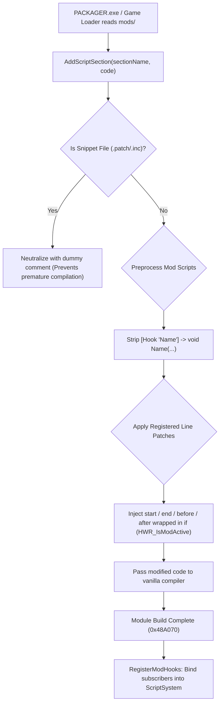

# Heroes of Hammerwatch 2 — Master AI Session Handover & Knowledge Base

> **CRITICAL DIRECTIVE FOR INCOMING AI AGENTS**:
> Read this document completely before modifying or proposing changes in this workspace. It contains the exact reverse engineering findings, memory addresses (RVAs), assembly trampolines, AngelScript vtable layouts, build toolchains, and modding invariants established across multiple deep engineering sessions.

---

## Table of Contents
1. [Workspace & Repository Layout](#1-workspace--repository-layout)
2. [Core Modding Invariants & Philosophy](#2-core-modding-invariants--philosophy)
3. [Reverse Engineering Encyclopedia (RVAs, Signatures & ABIs)](#3-reverse-engineering-encyclopedia)
4. [Universal Hook & Line-Patching Architecture](#4-universal-hook--line-patching-architecture)
5. [In-Game Developer Console (`s`, `scr`, and Color Channels)](#5-in-game-developer-console-architecture)
6. [Crash Guards (Profile Switch & Asset Reload)](#6-crash-guards-profile-switch--reload)
7. [Testing Harness & Hermetic Standards](#7-testing-harness--hermetic-standards)
8. [Build System & CI/CD Pipelines](#8-build-system--cicd-pipelines)
9. [Active Mods: PlayerDesyncFix & Watchdog Context](#9-active-mods-playerdesyncfix--watchdog)
10. ["If Lost" Troubleshooting & Decision Tree](#10-if-lost-troubleshooting--decision-tree)
11. [Master File Index & Purpose](#11-master-file-index--purpose)

---

## 1. Workspace & Repository Layout

There are **two distinct layers** in this workspace:

```text
E:\SteamLibrary\steamapps\common\Heroes of Hammerwatch 2 AGY\
│
├── HWR2.exe                        <-- The vanilla 64-bit game executable (NEVER MODIFY ON DISK)
├── winmm.dll                       <-- Deployed proxy DLL (copied from patch_scr)
├── proxy_winmm.log                 <-- Runtime diagnostic log generated by winmm.dll
├── HWR2.log                        <-- Vanilla engine log
├── unpacked_assets_<buildNumber>/  <-- Extracted game assets (dynamic folder name from PACKAGER.exe)
│
├── mods/                           <-- Mounted mod folders
│   ├── PlayerDesyncFix/            <-- Desync watchdog & crash prevention mod
│   └── CustomHooksMod/             <-- Hook demo / test mod
│
└── patch_scr/                      <-- THE STANDALONE PROXY DLL GIT REPOSITORY ROOT
    ├── .git/                       <-- Git repository for proxy DLL
    ├── .github/workflows/          <-- CI/CD (build.yml and release.yml)
    ├── .gitignore                  <-- Ignores *.obj, *.lib, winmm.dll, .vs/
    ├── include/                    <-- angelscript.h, HookEngine.h
    ├── minhook/                    <-- Embedded MinHook library (buffer, hook, trampoline, hde64)
    ├── src/                        <-- dllmain.cpp, HookEngine.cpp, winmm_proxy.cpp, winmm_exports.asm
    ├── tests/                      <-- Hermetic test suite & runners (test_hook_engine.cpp, .py, .ps1, .bat)
    ├── build.ps1 / build.bat       <-- MSVC build scripts
    ├── install.ps1 / install.bat   <-- Deploys compiled winmm.dll to parent game folder
    ├── winmm.def                   <-- Linker definition exporting all 180 WinMM functions
    └── README.md                   <-- GitHub documentation for proxy DLL
```

> **IMPORTANT**: `patch_scr/` is itself the root of an independent Git repository. All build tools, tests, and CI/CD workflows run relative to `patch_scr/`.

---

## 2. Core Modding Invariants & Philosophy

1. **Zero Disk Modification Invariant**:
   - `HWR2.exe` and official game `.bin` files are **NEVER modified on disk**.
   - All detours operate via Windows DLL proxying (`winmm.dll`) or runtime memory hooks (MinHook).
   - Deleting `winmm.dll` restores 100% vanilla state immediately.

2. **Windows DLL Proxying Standard**:
   - The game links against `winmm.dll` (Windows Multimedia API).
   - Our proxy DLL must export **all 180 official functions** declared in `winmm.def`.
   - On `DLL_PROCESS_ATTACH`, it dynamically loads `C:\Windows\System32\winmm.dll` via `LoadLibraryW`.
   - Calls bounce through naked 64-bit assembly trampolines in `src/winmm_exports.asm` (`ml64.exe`), preserving all registers (`rcx`, `rdx`, `r8`, `r9`, `xmm0-3`, stack frames).

3. **Update-Resilient Hooking**:
   - Never rely solely on static RVAs.
   - Exported symbols (`asCreateScriptEngine`) must be resolved via `GetProcAddress`.
   - Internal routines (`Console::ExecuteLine`, `Console::Print`) must be resolved via **runtime byte pattern scanning** across `.text` with fallback to known RVAs.

4. **Multi-Engine Context Verification**:
   - The game instantiates up to 5 embedded AngelScript engines (Bootstrap, UI, Menu, World, Preload).
   - Never inject gameplay helpers or patches into preload or scratch engines.
   - Script execution must traverse the active gameplay world:
     `pConsole -> GameEngine (+0x8) -> ActiveWorld (+0x98) -> ScriptSystem (+0x60) -> asIScriptEngine* (+0x158)`.

---

## 3. Reverse Engineering Encyclopedia

All verified memory addresses, signatures, and calling conventions for `HWR2.exe` (Release build, August 2026):

### 3.1 Function RVAs & Pattern Signatures

| Function Name | Known RVA (Release) | Beta RVA (Oct 2025) | Pattern Signature (.text) | Calling Convention & Arguments |
|---|---|---|---|---|
| **`Console::ExecuteLine`** | `0x1F44C0` | `0x1F4980` | `48 89 5C 24 18 48 89 54 24 10 55 56 57 41 54 41 55 41 56 41 57 48 8D AC 24 70 FE FF FF 48 81 EC 90 02 00 00` | `__fastcall (void* pConsole, StdString* pLine)` |
| **`Console::Print`** | `0x110D80` | `0x1114E0` | `48 89 54 24 10 4C 89 44 24 18 4C 89 4C 24 20 55 53 56 57 48 83 EC 48 48 8D 6C 24 30` | `__cdecl (int channel, const char* fmt, ...)` |
| **`asCreateScriptEngine`**| `0x454AD0` | — | Resolved via PE Export Table: `GetProcAddress(NULL, "asCreateScriptEngine")` | `__cdecl (uint32_t version)` |
| **`asCModule::AddScriptSection`** | `0x48A410` | — | Intercepts in-flight compilation pipeline | `__fastcall (void* pModule, const char* sectionName, const char* code, size_t codeLength, int lineOffset)` |
| **`asCModule::Build`** | `0x48A070` | — | Triggers post-compilation hook registration | `__fastcall (void* pModule)` |
| **`Hooks::RegisterHook`** | `0x130360` | — | Registers an `asIScriptFunction*` into `ScriptSystem` | `__fastcall (void* pScriptSys, void* pFunc)` |
| **`PersistentSaves::GetModded`** | `0x1F740` | — | Checks if active profile is modded | `__cdecl () -> bool` |
| **`e_cheats` pointer** | `0x632330` | — | Scanned dynamically 0x400 bytes into `Console::ExecuteLine` for `40 38 3D ... 74 1D` | `uint8_t*` (1 = cheats on, 0 = cheats off) |
| **`ResourceTaskLambda`** | `0x7BAD0` | — | `40 53 48 83 EC 20 48 8B 41 08 48 8B D9 48 8B 88 88 00 00 00 48 85 C9 74` | `__fastcall (void* thisPtr, void* pContext)` |
| **`SecondaryTaskLambda`** | `0x7BB40` | — | `48 89 5C 24 08 57 48 83 EC 20 48 8B 79 10 48 8B D9` | `__fastcall (void* thisPtr, void* pContext)` |

---

### 3.2 AngelScript Vtable Layout (MSVC x64 ABI in HWR2)

Because `HWR2.exe` compiles AngelScript with specific internal flags, generic AngelScript SDK vtable offsets **do not match**. Use these verified slot indices:

| Interface | Method | Slot Index | Byte Offset | Signature |
|---|---|---|---|---|
| `asIScriptEngine` | `GetModule` | **Slot 47** | `+0x178` | `(this, const char* name, int flag)` |
| `asIScriptEngine` | `RequestContext` | **Slot 69** | `+0x228` | `(this)` |
| `asIScriptEngine` | `ReturnContext` | **Slot 70** | `+0x230` | `(this, asIScriptContext* ctx)` |
| `asIScriptEngine` | `GetUserData` | **Slot 82** | `+0x290` | `(this, asPWORD type)` |
| `asIScriptContext`| `GetExceptionLineNumber` | **Slot 33** | `+0x108` | `(this, int* col, const char** section)` |
| `asIScriptContext`| `GetExceptionString` | **Slot 35** | `+0x118` | `(this)` |

---

## 4. Universal Hook & Line-Patching Architecture

The Hook Engine operates dynamically in memory during `asCModule::AddScriptSection`:



### 4.1 Configuration Standards
- **XML Packages** (`mods/*/info.xml`, `mods/*/hooks.xml`):
  Must nest `<array name="hooks">` and `<array name="patches">` inside the root `<dict>`:
  ```xml
  <dict>
      <string name="name">MyMod</string>
      <array name="hooks">
          <dict>
              <string name="class">Player</string>
              <string name="function">Damage</string>
              <string name="custom_call_name">OnPlayerDamage</string>
          </dict>
      </array>
      <array name="patches">
          <dict>
              <string name="class">PlayerRecord</string>
              <string name="function">RefreshModifiers</string>
              <string name="action">end</string>
              <string name="file">patches/my_patch.patch</string>
          </dict>
      </array>
  </dict>
  ```
- **Binary Packages** (`.bin` SValue Dictionaries):
  Decoded directly from Steam Workshop (`workshop/content/<AppID>/*/*.bin`) and local packages (`mods/*.bin`).
- **NO `hooks.json`**: JSON hooking was completely removed in favor of standard XML and `.bin` formats.

### 4.2 Snippet Neutralization Invariant
External patch snippets **must use `.patch` or `.inc` extensions**, never `.as`. The proxy intercepts them and replaces their payload with `// Neutralized snippet file` so the engine does not compile raw code fragments out-of-context.

---

## 5. In-Game Developer Console Architecture

### 5.1 Commands: `s` and `scr`
- **`scr <expression>`**: Evaluates expressions using `_cgrab(<expr>)` and prints the return value.
- **`s <statements>`**: Executes arbitrary statements. Injects `auto sunit = GetSelectedUnit();` into local scope.
- **Safety Gate**:
  Commands will **only execute** if:
  1. `PersistentSaves::GetModded() == true` (profile is modded).
  2. `e_cheats == 1` (cheats are enabled).
  Otherwise, execution is refused with clear console feedback.

### 5.2 Console Color Categories (The Golden Rule)
The in-game developer console (`~`) **does NOT parse inline formatting tags** (`\cRRGGBB` or `\d`).
Line color is strictly controlled by the **`channel` (1st parameter)** of `Console::Print(channel, fmt, ...)`:

| Channel ID | Enum Constant | Color in Console | Usage |
|---|---|---|---|
| **`0`** | `CONSOLE_CHANNEL_INFO` | **White** | Normal info, command echoing (`> s ...`), hook registrations |
| **`1`** | `CONSOLE_CHANNEL_WARNING` | **Yellow** | Crash guard interventions, syntax usage tips |
| **`2`** | `CONSOLE_CHANNEL_ERROR` | **Red** | Compilation errors, exception traces, SEH access violation catches |

---

## 6. Crash Guards (Profile Switch & Reload)

### The Problem
When players reload assets or rapidly switch save profiles, the engine tears down the active gameplay module (`Scripts`). If worker threads in the task queue execute asynchronous lambdas with stale or dangling resource pointers, the engine throws access violation `0xC0000005`.

### The Solution (Hardware SEH + Early Exit)
We hook `0x7BAD0` (`Hooked_ResourceTaskLambda`) and `0x7BB40` (`Hooked_SecondaryTaskLambda`):
1. Low-memory pointer checks: `if ((uintptr_t)ptr < 0x10000) return;`
2. Wrapped in `__try / __except (EXCEPTION_EXECUTE_HANDLER)`.
3. Returning immediately without calling the original lambda matches the engine's native null branch (`test rcx, rcx; je 0x7BB2E`), allowing the scheduler to retire the task safely without crashing.

---

## 7. Testing Harness & Hermetic Standards

### 7.1 The Invariant
**Never hardcode `unpacked_assets_157` or any specific build number in tests.**
`PACKAGER.exe` names unpacked directories dynamically based on game patches (`unpacked_assets_<buildNumber>`), and clean checkouts may have no unpacked assets at all.

### 7.2 The Harness Design
- **Hermetic by Default**: Both C++ ([`tests/test_hook_engine.cpp`](file:///e:/SteamLibrary/steamapps/common/Heroes%20of%20Hammerwatch%202%20AGY/patch_scr/tests/test_hook_engine.cpp)) and Python ([`tests/test_hook_engine.py`](file:///e:/SteamLibrary/steamapps/common/Heroes%20of%20Hammerwatch%202%20AGY/patch_scr/tests/test_hook_engine.py)) embed self-contained script fixtures (`kMockPlayerScript`, `kMockPlayerRecordScript`, `kMockGameModeScript`).
- **Dynamic Discovery (`FindUnpackedAssetsDir`)**: Searches `..\..\unpacked_assets_*`, `..\unpacked_assets_*`, and `unpacked_assets_*`. If found, performs optional live validation; if missing, cleanly skips without error.
- **Test Runners**:
  ```powershell
  cd patch_scr
  .\tests\run_tests.ps1   # PowerShell runner
  .\tests\run_tests.bat   # CMD runner
  ```

---

## 8. Build System & CI/CD Pipelines

### 8.1 Building Locally
Requires **Visual Studio 2022** (or Visual Studio Build Tools with Desktop C++):
```powershell
cd patch_scr
.\build.ps1     # Compiles winmm.dll with all 180 exports
.\install.ps1   # Deploys winmm.dll to parent game folder
```

### 8.2 GitHub Actions Workflows
Located in [`patch_scr/.github/workflows/`](file:///e:/SteamLibrary/steamapps/common/Heroes%20of%20Hammerwatch%202%20AGY/patch_scr/.github/workflows):
1. **`build.yml` (CI & On-Demand)**:
   - Triggers on `push` and `pull_request` to `main`/`master`, or manual button click.
   - Runs tests, builds `winmm.dll`, and saves it as a 14-day downloadable artifact.
2. **`release.yml` (Manual Release Only)**:
   - Triggered **manually only** via GitHub Actions web UI (`workflow_dispatch`).
   - Interactive inputs: Version tag (e.g. `v1.0.0`), Release title, Notes, Draft/Pre-release checkboxes.
   - Runs test quality gate, compiles DLL, and publishes the official GitHub Release with `winmm.dll` attached.
   - Safe for public repositories (uses ephemeral `${{ secrets.GITHUB_TOKEN }}`).

---

## 9. Active Mods: PlayerDesyncFix & Watchdog

### 9.1 The Multiplayer Desync Bug
- **Symptoms**: In multiplayer sessions (or client-host reconnects), rapid unit recycling causes a race condition where the local `Player` unit is destroyed or detached while the `PlayerRecord` and `AGameplayGameMode` camera remain active. The player becomes invisible or the camera detaches into the void.
- **Singleplayer vs Multiplayer Finding**: Singleplayer stress tests (even 100,000 recycle loops) **do not reproduce the desync** because it requires client/host network latency and packet desynchronization.

### 9.2 The Prevention Patches
Located in [`mods/PlayerDesyncFix/patches/`](file:///e:/SteamLibrary/steamapps/common/Heroes%20of%20Hammerwatch%202%20AGY/mods/PlayerDesyncFix/patches):
- `assign_unit_guard.patch`: Line patch into `PlayerRecord::AssignUnit` preventing invalid null unit assignment.
- `camera_guard.patch`: Line patch into `AGameplayGameMode::GetCameraPos` preventing null camera reference crashes.

### 9.3 The Prevention Toggle
To allow testing the raw desync behavior versus prevented behavior, the patches check:
```angelscript
if (GlobalCache::Get("watchdog_prevention") == "1") {
    // Prevention code active
}
```
Toggle in console via:
- `s GlobalCache::Set("watchdog_prevention", "1");` (Prevention ON)
- `s GlobalCache::Set("watchdog_prevention", "0");` (Prevention OFF)

---

## 10. "If Lost" Troubleshooting & Decision Tree

If something goes wrong in a future session, follow this decision tree:

```text
[Problem Encountered]
│
├── Game crashes on launch before window opens?
│   ├── Check winmm.def: Are all 180 exports present? (Missing exports crash with Entry Point Not Found).
│   └── Check proxy_winmm.log: Did MinHook fail during MH_Initialize or pattern scanning?
│
├── Game loads, but Main Menu is blank / missing?
│   ├── AngelScript compilation failure in Scripts or Menu module!
│   ├── Check proxy_winmm.log for "[Patch Error]" or "SE : ...".
│   ├── Did someone use undefined global variables in a patch? (Use GlobalCache::Get instead of static class vars).
│   └── Did someone name a patch snippet ".as"? (Must be ".patch" or ".inc").
│
├── "s" or "scr" console command says "Command can only be executed on a modded profile"?
│   ├── Switch to a modded save profile in the main menu, OR
│   └── In console, type "e_cheats 1" and verify PersistentSaves::GetModded() is true.
│
├── In-game console logs are the wrong color?
│   ├── Do NOT use \cRRGGBB tags!
│   └── Check first parameter to Console::Print: 0 = White (Info), 1 = Yellow (Warn), 2 = Red (Error).
│
└── Tests fail saying "folder not found"?
    └── Check if an old script hardcoded "unpacked_assets_157". Use FindUnpackedAssetsDir() instead.
```

---

## 11. Master File Index & Purpose

| File Path | Purpose |
|---|---|
| [`SESSION_HANDOVER.md`](file:///e:/SteamLibrary/steamapps/common/Heroes%20of%20Hammerwatch%202%20AGY/SESSION_HANDOVER.md) | **This master document**. Highest-priority briefing for all AI agents. |
| [`AGENTS.md`](file:///e:/SteamLibrary/steamapps/common/Heroes%20of%20Hammerwatch%202%20AGY/AGENTS.md) | Workspace rules and strict invariants (10 rules total). |
| [`patch_scr/SESSION_HANDOVER.md`](file:///e:/SteamLibrary/steamapps/common/Heroes%20of%20Hammerwatch%202%20AGY/patch_scr/SESSION_HANDOVER.md) | Mirror copy stored within the proxy DLL repository. |
| [`patch_scr/README.md`](file:///e:/SteamLibrary/steamapps/common/Heroes%20of%20Hammerwatch%202%20AGY/patch_scr/README.md) | Public GitHub README explaining architecture, prerequisites, and build steps. |
| [`patch_scr/src/dllmain.cpp`](file:///e:/SteamLibrary/steamapps/common/Heroes%20of%20Hammerwatch%202%20AGY/patch_scr/src/dllmain.cpp) | Entry point of `winmm.dll`, MinHook hooks, SEH crash guards, and console detours. |
| [`patch_scr/src/HookEngine.cpp`](file:///e:/SteamLibrary/steamapps/common/Heroes%20of%20Hammerwatch%202%20AGY/patch_scr/src/HookEngine.cpp) | Dynamic script hooker, XML / `.bin` SValue parser, and brace-depth line patcher. |
| [`patch_scr/include/HookEngine.h`](file:///e:/SteamLibrary/steamapps/common/Heroes%20of%20Hammerwatch%202%20AGY/patch_scr/include/HookEngine.h) | Data structures, `ConsoleChannel` enum (`INFO`, `WARNING`, `ERROR`), and public interface. |
| [`patch_scr/src/winmm_exports.asm`](file:///e:/SteamLibrary/steamapps/common/Heroes%20of%20Hammerwatch%202%20AGY/patch_scr/src/winmm_exports.asm) | 180 naked assembly trampolines forwarding to real `System32\winmm.dll`. |
| [`patch_scr/winmm.def`](file:///e:/SteamLibrary/steamapps/common/Heroes%20of%20Hammerwatch%202%20AGY/patch_scr/winmm.def) | Linker export definition for all 180 WinMM functions. |
| [`patch_scr/tests/test_hook_engine.cpp`](file:///e:/SteamLibrary/steamapps/common/Heroes%20of%20Hammerwatch%202%20AGY/patch_scr/tests/test_hook_engine.cpp) | Hermetic C++ unit test harness with dynamic asset discovery. |
| [`patch_scr/tests/test_hook_engine.py`](file:///e:/SteamLibrary/steamapps/common/Heroes%20of%20Hammerwatch%202%20AGY/patch_scr/tests/test_hook_engine.py) | Hermetic Python unit test suite. |
| [`patch_scr/.github/workflows/build.yml`](file:///e:/SteamLibrary/steamapps/common/Heroes%20of%20Hammerwatch%202%20AGY/patch_scr/.github/workflows/build.yml) | GitHub Actions CI workflow (tests + build + artifact upload). |
| [`patch_scr/.github/workflows/release.yml`](file:///e:/SteamLibrary/steamapps/common/Heroes%20of%20Hammerwatch%202%20AGY/patch_scr/.github/workflows/release.yml) | GitHub Actions manual release publisher with interactive inputs. |
| [`.agents/skills/hwr2-modding-and-scripting/SKILL.md`](file:///e:/SteamLibrary/steamapps/common/Heroes%20of%20Hammerwatch%202%20AGY/.agents/skills/hwr2-modding-and-scripting/SKILL.md) | Agent skill runbook containing cheatsheets, vtable indices, and command patterns. |
