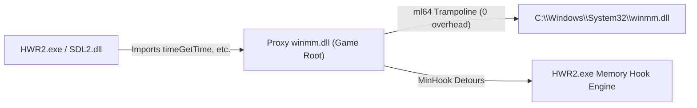

# Comprehensive Technical Report: Reverse Engineering and Restoring Console Script Execution ("s" & "scr") in Heroes of Hammerwatch 2

---

## Table of Contents
1. [Executive Summary & Problem Statement](#1-executive-summary--problem-statement)
2. [Reverse Engineering Analysis: Release vs. Beta Binaries](#2-reverse-engineering-analysis-release-vs-beta-binaries)
   - [2.1 AngelScript Subsystem Status in Release](#21-angelscript-subsystem-status-in-release)
   - [2.2 Missing Command Registration in Release Dispatch Table](#22-missing-command-registration-in-release-dispatch-table)
   - [2.3 Reversing Developer Command Behavior in the Beta (`HWR2_beta_10084.exe`)](#23-reversing-developer-command-behavior-in-the-beta-hwr2_beta_10084exe)
   - [2.4 The Native Helper Function: `_cgrab`](#24-the-native-helper-function-_cgrab)
   - [2.5 The Selected Unit Variable: `sunit`](#25-the-selected-unit-variable-sunit)
3. [The Proxy DLL Architecture (`winmm.dll`)](#3-the-proxy-dll-architecture-winmmdll)
   - [3.1 Selection of the Proxy Target](#31-selection-of-the-proxy-target)
   - [3.2 Solving Windows Loader Procedure Entry Point Errors](#32-solving-windows-loader-procedure-entry-point-errors)
   - [3.3 180-Export Assembly Trampolines & Dynamic Forwarding](#33-180-export-assembly-trampolines--dynamic-forwarding)
   - [3.4 Detouring `Console::ExecuteLine` vs. Cvar Injection](#34-detouring-consoleexecuteline-vs-cvar-injection)
4. [Binary MSVC x64 ABI & AngelScript Vtable Reversing](#4-binary-msvc-x64-abi--angelscript-vtable-reversing)
   - [4.1 The Vtable Slot Index Mismatch (`GetModule`)](#41-the-vtable-slot-index-mismatch-getmodule)
   - [4.2 The SEH Inverted Exception Slot Bug](#42-the-seh-inverted-exception-slot-bug)
   - [4.3 Complete Verified Vtable Offsets](#43-complete-verified-vtable-offsets)
5. [Unpacking `res/assets.bin` & The Mystery of `GetLocalPlayerRecord() == null`](#5-unpacking-resassetsbin--the-mystery-of-getlocalplayerrecord--null)
   - [5.1 The `HW2R` Binary Container Format](#51-the-hw2r-binary-container-format)
   - [5.2 Decompiling the AngelScript Game Scripts](#52-decompiling-the-angelscript-game-scripts)
   - [5.3 Discovery of the 5 Distinct Script Engines (The Preload Engine Trap)](#53-discovery-of-the-5-distinct-script-engines-the-preload-engine-trap)
   - [5.4 Reversing Active World Resolution (`0x14009FCF0` and `0x14008BECD`)](#54-reversing-active-world-resolution-0x14009fcf0-and-0x14008becd)
6. [The Complete Implementation (`patch_scr/`)](#6-the-complete-implementation-patch_scr)
   - [6.1 Project Directory Structure](#61-project-directory-structure)
   - [6.2 Architecture Walkthrough: `dllmain.cpp`](#62-architecture-walkthrough-dllmaincpp)
   - [6.3 Exception Safety & SEH Containment](#63-exception-safety--seh-containment)
   - [6.4 Diagnostic Meta-Commands: `__engines` and `__use`](#64-diagnostic-meta-commands-__engines-and-__use)
   - [6.5 Automated Build & Deployment Pipeline](#65-automated-build--deployment-pipeline)
7. [AngelScript Developer Console Cheatsheet](#7-angelscript-developer-console-cheatsheet)
   - [7.1 Core Commands (`s` vs `scr`)](#71-core-commands-s-vs-scr)
   - [7.2 Inspecting the Player & Stats](#72-inspecting-the-player--stats)
   - [7.3 Modifying Attributes & Materials](#73-modifying-attributes--materials)
   - [7.4 Town, NPCs, and Selected Unit Inspection](#74-town-npcs-and-selected-unit-inspection)

---

## 1. Executive Summary & Problem Statement

In the developer builds of *Heroes of Hammerwatch 2* (such as `HWR2_beta_10084.exe`), developers and testers had access to two console commands for live script evaluation in the tilde (`~`) console:
- **`s <statements>`**: Executes arbitrary AngelScript code statements with a pre-bound `sunit` variable pointing to the currently targeted or selected unit.
- **`scr <expression>`**: Evaluates any AngelScript expression (variables, function calls, arithmetic, object properties) and automatically formats and prints the resulting value or object reference to the console.

In the commercial Steam release (`HWR2.exe`), typing `s` or `scr` produced:
```text
No such cvar: s
No such cvar: scr
```
The user goal was to restore full, unrestricted access to `s` and `scr` in the release executable **without modifying or patching the original `HWR2.exe` file on disk** (preserving Steam file integrity, cloud saves, and checksums).

This project accomplished that goal by constructing a **zero-dependency proxy DLL (`winmm.dll`)** equipped with inline detours (MinHook), deep ABI reverse engineering, multi-engine active world resolution, and Structured Exception Handling (SEH).

---

## 2. Reverse Engineering Analysis: Release vs. Beta Binaries

To establish feasibility and design the restoration mechanism, static and dynamic analysis was conducted across both binaries:
- **Target Release Binary**: `HWR2.exe` (SHA256: `6,886,912` bytes, AngelScript 2.37.0)
- **Reference Developer Beta**: `HWR2_beta_10084.exe` (SHA256: `6,876,672` bytes)

### 2.1 AngelScript Subsystem Status in Release
A common industry practice during release builds is compiling AngelScript with `#define AS_NO_COMPILER`, stripping the lexical analyzer, parser, compiler, and bytecode generator to save binary space and harden against cheating.

Binary analysis revealed that **the compiler was NOT stripped**:
1. **Intact Compiler Strings**: Strings from `as_compiler.cpp` and `as_parser.cpp` reside at VA `0x1405AC150` in `HWR2.exe`:
   - `"Unexpected token '%s'"`
   - `"Reference types cannot be returned by value"`
   - `"No matching operator that takes the types..."`
2. **Exported Engine Symbols**: `HWR2.exe` directly exports 26 AngelScript runtime functions in its PE export table, including `asCreateScriptEngine` (`RVA 0x454AD0`) and `asGetActiveContext` (`RVA 0x45E5D0`).
3. **Engine Version**: Constant `0x5C94` (AngelScript v2.37.0) passed to `asCreateScriptEngine` at RVA `0x132117`.

### 2.2 Missing Command Registration in Release Dispatch Table
By disassembling the console command initialization routine:
- In `HWR2_beta_10084.exe` at VA `0x14009E335`, the engine registers `"s"` and `"scr"` into the command dispatcher with callbacks `0x14009A120` and `0x14009CCC0`.
- In `HWR2.exe`, the registration calls for `"s"` and `"scr"` were simply omitted from the initialization list, leaving the underlying compiler and execution functions intact but unreferenced by the console parser.

### 2.3 Reversing Developer Command Behavior in the Beta (`HWR2_beta_10084.exe`)
Decompiling `0x14009A120` and `0x14009CCC0` revealed the exact wrapper syntax used by the game developers:

#### Expression Command (`scr`)
In `0x14009CCC0`, user input is wrapped into a synthetic global function:
```angelscript
void ExecuteString() {
    _cgrab(
        <user_expression>
    );
}
```

#### Statement Command (`s`)
In `0x14009A120`, the command first attempts the `_cgrab` wrapper while pre-injecting `sunit`:
```angelscript
void ExecuteString() {
    auto sunit = GetSelectedUnit();
    _cgrab(
        <user_code>
    );
}
```
If `_cgrab` fails to compile (e.g. when `<user_code>` is a statement such as `for (...)` or `print(...)` that does not evaluate to a value), it falls back to:
```angelscript
void ExecuteString() {
    auto sunit = GetSelectedUnit();
    <user_code>;
}
```

### 2.4 The Native Helper Function: `_cgrab`
`_cgrab` is an internal engine function registered at VA `0x14055243D` in `HWR2.exe`. It features 10 overloads:
```angelscript
void _cgrab();
void _cgrab(bool);
void _cgrab(int);
void _cgrab(int64);
void _cgrab(uint);
void _cgrab(uint64);
void _cgrab(float);
void _cgrab(double);
void _cgrab(const string &in);
void _cgrab(const ref &in);
```
The overload `void _cgrab(const ref &in)` is polymorphic: it accepts **any handle, class instance, or engine object**, introspects its type, and prints either `Engine Object [TypeName]` or `[???] Null` directly to the developer console without requiring custom string concatenation operators.

### 2.5 The Selected Unit Variable: `sunit`
The native function `UnitPtr GetSelectedUnit()` is registered at VA `0x140559AC8` in `HWR2.exe`. Injecting `auto sunit = GetSelectedUnit();` makes whatever unit is under the player's crosshair immediately accessible in the console.

---

## 3. The Proxy DLL Architecture (`winmm.dll`)

### 3.1 Selection of the Proxy Target
To inject code without modifying `HWR2.exe`:
- `HWR2.exe` loads external dependencies: `SDL2.dll`, `steam_api64.dll`, `fmod.dll`, and `fmodstudio.dll`.
- On Windows, `winmm.dll` (Windows Multimedia API) is loaded automatically by `SDL2.dll` and audio systems. Placing a custom `winmm.dll` into the game root causes the OS loader to bind to our proxy DLL prior to game initialization.

### 3.2 Solving Windows Loader Procedure Entry Point Errors
Early proxy attempts triggered Windows loader dialog errors:
- *"The procedure entry point timeGetTime could not be located in dynamic link library fmod.dll"*
- *"The procedure entry point mixerSetControlDetails could not be located in dynamic link library steamclient64.dll"*
- *"The procedure entry point waveInClose could not be located in dynamic link library SDL2.dll"*

#### Root Cause
Windows `winmm.dll` exports **180 functions**, including legacy joystick, MIDI, and mixer APIs. If a proxy exports only a subset (or attempts ordinal-only forwarding), any dependent library querying unforwarded symbols aborts load with a procedure entry point failure.

### 3.3 180-Export Assembly Trampolines & Dynamic Forwarding
The issue was permanently resolved by generating a complete, 180-symbol export table:
1. **Dynamic Resolution (`winmm_proxy.cpp`)**: On `DLL_PROCESS_ATTACH`, loads `C:\Windows\System32\winmm.dll` and resolves all 180 original procedure addresses into a function pointer table (`g_pOriginalProcs[180]`).
2. **Naked Assembly Trampolines (`winmm_exports.asm`)**: Compiled via Microsoft Macro Assembler (`ml64.exe`). Each exported function executes a single, transparent tail-call jump to the real Windows DLL:
   ```x86asm
   EXPORT_TRAMPOLINE timeGetTime, 148
   ; Expands to:
   ; timeGetTime PROC
   ;     jmp QWORD PTR [g_pOriginalProcs + 148 * 8]
   ; timeGetTime ENDP
   ```
3. **Module Definition File (`winmm.def`)**: Exports all 180 symbol names identically to Microsoft's system DLL.



### 3.4 Detouring `Console::ExecuteLine` vs. Cvar Injection
Rather than mutating internal cvar hash maps, the proxy places an inline hook on the console dispatcher:
- **Target Function**: `Console::ExecuteLine` (`RVA 0x1F44C0`, VA `0x1401F44C0`).
- **Signature**: `void Console::ExecuteLine(Console* pConsole, const StdString* pLine);`
- **Mechanism**: The hook intercepts incoming console text before cvar validation:
  - If the line starts with `s ` or `scr `, it consumes the command, compiles and executes the script, echos output to the console, and returns immediately.
  - All other commands (`e_cheats`, `fps`, etc.) are forwarded unmodified to the original `Console::ExecuteLine`.

---

## 4. Binary MSVC x64 ABI & AngelScript Vtable Reversing

During initial execution tests, calling AngelScript methods through standard SDK headers resulted in crashes and access violations. Reverse engineering the compiled machine code in `HWR2.exe` uncovered discrepancies between standard SDK vtables and MSVC compiler layout.

### 4.1 The Vtable Slot Index Mismatch (`GetModule`)
- In vanilla AngelScript 2.37.0 SDK headers, `asIScriptEngine::GetModule` is declared at **Slot 49** (`offset +0x188`).
- In `HWR2.exe`, disassembling `0x1404516E0` revealed `GetModule` is at **Slot 47** (`offset +0x178`).
- **The Crash Mechanism**: Slot 49 in `HWR2.exe` is actually `GetModuleCount()`, which returns an integer count (e.g. `1`). Casting `1` to `asIScriptModule*` caused the subsequent call to `mod->CompileFunction(...)` to dereference address `0x0000000000000001`, resulting in an instant crash (`0xC0000005`).

### 4.2 The SEH Inverted Exception Slot Bug
When user scripts threw runtime exceptions (such as `Null pointer access`), the exception handler crashed:
- Generic SDK headers list `GetExceptionLineNumber` at Slot 33 and `GetExceptionString` at Slot 35.
- Disassembly of `asCScriptContext` vtable (`0x1405ABA78`) showed the order was inverted:
  - **Slot 33**: `int GetExceptionLineNumber(int* col, const char** section)` (offset `+0x108`). Calling it with no arguments caused the CPU to write to invalid memory in register `rdx`.
  - **Slot 35**: `const char* GetExceptionString()` (offset `+0x118`).
Correcting the signature and arguments to `fn(ctx, nullptr, nullptr)` eliminated the secondary crash and allowed exception strings to print cleanly.

### 4.3 Complete Verified Vtable Offsets

#### `asIScriptEngine` (Vtable at `0x14059F7A8`)
| Method | Slot | Byte Offset | Address in `HWR2.exe` | Calling Signature |
| :--- | :--- | :--- | :--- | :--- |
| `GetModule` | **47** | `+0x178` | `0x1404516E0` | `asIScriptModule* (void* this, const char* name, int flag)` |
| `GetModuleCount` | **49** | `+0x188` | `0x140451830` | `asUINT (void* this)` |
| `GetModuleByIndex` | **50** | `+0x190` | `0x140451850` | `asIScriptModule* (void* this, asUINT index)` |
| `CreateContext` | **61** | `+0x1E8` | `0x140441E20` | `asIScriptContext* (void* this)` |
| `RequestContext` | **69** | `+0x228` | `0x140452800` | `asIScriptContext* (void* this)` |
| `ReturnContext` | **70** | `+0x230` | `0x1404527F0` | `int (void* this, asIScriptContext* ctx)` |
| `GarbageCollect` | **73** | `+0x248` | `0x140449D40` | `int (void* this, asDWORD flags)` |

#### `asIScriptModule`
| Method | Slot | Byte Offset | Calling Signature |
| :--- | :--- | :--- | :--- |
| `GetName` | **1** | `+0x08` | `const char* (void* this)` |
| `CompileFunction` | **6** | `+0x30` | `int (void* this, const char* section, const char* code, int lineOffset, asDWORD flags, asIScriptFunction** outFunc)` |
| `RemoveFunction` | **15** | `+0x78` | `int (void* this, asIScriptFunction* func)` |

#### `asIScriptContext` (Vtable at `0x1405ABA78`)
| Method | Slot | Byte Offset | Calling Signature |
| :--- | :--- | :--- | :--- |
| `Release` | **1** | `+0x08` | `int (void* this)` |
| `GetEngine` | **2** | `+0x10` | `asIScriptEngine* (void* this)` |
| `Prepare` | **3** | `+0x18` | `int (void* this, asIScriptFunction* func)` |
| `Unprepare` | **4** | `+0x20` | `int (void* this)` |
| `Execute` | **5** | `+0x28` | `int (void* this)` |
| `GetExceptionLineNumber` | **33** | `+0x108` | `int (void* this, int* col, const char** section)` |
| `GetExceptionFunction` | **34** | `+0x110` | `asIScriptFunction* (void* this)` |
| `GetExceptionString` | **35** | `+0x118` | `const char* (void* this)` |

---

## 5. Unpacking `res/assets.bin` & The Mystery of `GetLocalPlayerRecord() == null`

With the vtable and exception handler fixed, commands executed cleanly without crashing. However, a major puzzle arose:
When loaded into Town with an active character, running:
```text
scr GetLocalPlayerRecord()
```
consistently evaluated to `[???] Null`, and `scr GetLocalPlayerRecord().name` threw `Null pointer access`.

To understand why, we reverse-engineered the game's internal data container and decompiled its scripts.

### 5.1 The `HW2R` Binary Container Format
All game scripts and resources reside packed inside `res/assets.bin` (`129,251,979` bytes).
By reverse-engineering `PACKAGER.exe` and inspecting binary offsets, the format specification was decoded:
- **Header**:
  - `Magic`: 4 bytes ASCII (`"HW2R"`)
  - `Version`: 1 byte (`0x04`)
  - `TotalUncompressedSize`: 8 bytes (`uint64`)
  - `Padding`: 4 bytes (`uint32`)
  - `FileCount`: 4 bytes (`uint32`, 15,523 files)
- **File Entries**:
  - `NameLength`: 4 bytes (`uint32`)
  - `FileName`: `NameLength` bytes (UTF-8 string)
  - `Flag`: 1 byte (`0x01` = text/data, `0x03` = textures/binary)
  - `UncompressedSize`: 4 bytes (`uint32`)
  - `CompressedSize`: 4 bytes (`uint32`)
  - `Payload`: If `CompressedSize != 0`, the stream is raw **LZ4 Block compressed** (`CompressedSize` bytes); if `0`, it is raw uncompressed (`UncompressedSize` bytes).

A pure Python script with an inline LZ4 block decompressor was written to unpack and search the script files without third-party dependencies.

### 5.2 Decompiling the AngelScript Game Scripts
Searching for `GetLocalPlayerRecord` located its definition in `scripts/main.as` (lines 581–606):
```angelscript
Player@ GetLocalPlayer()
{
    for (uint i = 0; i < g_players.length(); i++)
    {
        if (g_players[i].peer == 255)
            continue;
        if (g_players[i].local)
            return cast<Player>(g_players[i].actor);
    }
    return null;
}

PlayerRecord@ GetLocalPlayerRecord()
{
    for (uint i = 0; i < g_players.length(); i++)
    {
        if (g_players[i].peer == 255)
            continue;
        if (g_players[i].local)
            return g_players[i];
    }
    return null;
}
```
Inspection of `HWR2.exe.log` showed:
```text
[NFO] [03:41:30] ActivatePlayerRecord: 0 (local) : 00000000-0000-0000-0000-000000000000
[NFO] [03:41:31] Spawn player 0
```
This confirmed that player 0 was registered as local and spawned into `g_players`. Why then was `GetLocalPlayerRecord()` returning null during our console execution?

### 5.3 Discovery of the 5 Distinct Script Engines (The Preload Engine Trap)
Examining our diagnostic log (`patch_scr.log`) revealed that `asCreateScriptEngine` was called **five times** during startup:
```text
[Patch] Captured asIScriptEngine* from asCreateScriptEngine: 0000023231B76CD0
[Patch] Captured asIScriptEngine* from asCreateScriptEngine: 000002329341DCB0
[Patch] Captured asIScriptEngine* from asCreateScriptEngine: 000002329341DCB0
[Patch] Captured asIScriptEngine* from asCreateScriptEngine: 0000023293425000
[Patch] Captured asIScriptEngine* from asCreateScriptEngine: 0000023293420AD0
```
Notice what happened when the user executed `scr print("hello");`:
```text
[NFO] [03:41:58] [preload] hello
```
The output prefix was `[preload]`!
Our initial hook captured `engine` on every `asCreateScriptEngine` invocation and stored it into a single global variable `g_pCapturedEngine`. As a result, `g_pCapturedEngine` was overwritten by **Engine #4: the Asset Preload Engine**. In the preload engine, no levels, towns, or player records exist—its `g_players` array is perpetually empty (`length == 0`).

### 5.4 Reversing Active World Resolution (`0x14009FCF0` and `0x14008BECD`)
To determine how the native engine avoids this issue, we disassembled garbage collection and world update routines in `HWR2.exe` at `0x14009FCF0` and `0x14008BECD`:
```x86asm
; Disassembly from HWR2.exe at 0x14009FCF0
mov rax, [rbx + 8]          ; rbx is Console* or Context -> GameEngine*
mov rcx, [rax + 0x98]       ; GameEngine + 0x98 = ActiveWorld*
test rcx, rcx
jz fallback
mov rax, [rcx + 0x60]       ; ActiveWorld + 0x60 = ScriptSystem*
test rax, rax
jz fallback
mov rcx, [rax + 0x158]      ; ScriptSystem + 0x158 = Live asIScriptEngine*!
```
```x86asm
; Disassembly from HWR2.exe at 0x14008BECD
mov rax, [rip + 0x5BC94C]   ; Global Application Pointer at VA 0x140648820
mov r8,  [rax + 0x38]       ; GameEngine*
mov rax, [r8 + 0x98]        ; ActiveWorld*
```

The game maintains independent script engines for subsystems and worlds. The **live gameplay engine** must be dynamically resolved by traversing:
```text
pConsole -> GameEngine (+0x8) -> ActiveWorld (+0x98) -> ScriptSystem (+0x60) -> asIScriptEngine* (+0x158)
```
When this dynamic resolution path was implemented in `dllmain.cpp`, `GetLocalPlayerRecord()` immediately bound to the live game world engine, returning the player record.

---

## 6. The Complete Implementation (`patch_scr/`)

### 6.1 Project Directory Structure
```
patch_scr/
├── include/
│   └── (local headers)
├── minhook/
│   ├── include/MinHook.h
│   └── src/ (buffer.c, hook.c, trampoline.c, hde64.c)
├── src/
│   ├── dllmain.cpp           # Core detours, active world engine resolver, execution logic
│   ├── winmm_proxy.cpp       # Dynamic loader for System32\winmm.dll (180 entries)
│   └── winmm_exports.asm     # 180 ml64 assembly jump trampolines
├── winmm.def                 # Module definition file exporting all 180 procedures
├── build.ps1 / build.bat     # Build scripts for MSVC x64
├── install.ps1 / install.bat # Installs winmm.dll to game directory
├── uninstall.ps1             # Uninstalls proxy DLL
└── winmm.dll                 # Compiled 64-bit proxy DLL (60,928 bytes)
```

### 6.2 Architecture Walkthrough: `dllmain.cpp`
The core engine resolution and execution logic operates as follows:

```cpp
// Traverses GameEngine -> ActiveWorld (+0x98) -> ScriptSystem (+0x60) -> asIScriptEngine* (+0x158)
static void* GetScriptEngine(void* pConsole) {
    if (g_ForcedEngineIndex >= 0 && g_ForcedEngineIndex < (int)g_CapturedEngines.size()) {
        return g_CapturedEngines[g_ForcedEngineIndex];
    }

    auto SafeRead = [](void* ptr) -> void* {
        __try {
            if (ptr && !IsBadReadPtr(ptr, sizeof(void*))) {
                return *(void**)ptr;
            }
        } __except (EXCEPTION_EXECUTE_HANDLER) {}
        return nullptr;
    };

    void* candidates[4] = { nullptr };
    int numCandidates = 0;

    if (pConsole) {
        void* c1 = SafeRead((char*)pConsole + 8);
        if (c1) candidates[numCandidates++] = c1;

        void* c2 = SafeRead(pConsole);
        if (c2 && c2 != c1) candidates[numCandidates++] = c2;
    }

    if (g_BaseAddress) {
        void* pGlobalObj = SafeRead((void*)(g_BaseAddress + 0x648820));
        if (pGlobalObj) {
            void* c3 = SafeRead((char*)pGlobalObj + 0x38);
            if (c3) candidates[numCandidates++] = c3;
        }
    }

    for (int i = 0; i < numCandidates; i++) {
        void* pEng = candidates[i];
        if (!pEng) continue;

        // Active World (+0x98) -> Script System (+0x60) -> Script Engine (+0x158)
        void* pActiveWorld = SafeRead((char*)pEng + 0x98);
        if (pActiveWorld) {
            void* pScriptSys = SafeRead((char*)pActiveWorld + 0x60);
            if (pScriptSys) {
                void* se = SafeRead((char*)pScriptSys + 0x158);
                if (se) return se;
            }
        }

        // Fallback World (+0x100) -> Script System (+0x18) -> Script Engine (+0x158)
        void* pFallbackWorld = SafeRead((char*)pEng + 0x100);
        if (pFallbackWorld) {
            void* pScriptSys = SafeRead((char*)pFallbackWorld + 0x18);
            if (pScriptSys) {
                void* se = SafeRead((char*)pScriptSys + 0x158);
                if (se) return se;
            }
        }
    }

    // Default to Engine 0 (primary gameplay bootstrap engine), avoiding scratch/preload engines
    if (!g_CapturedEngines.empty()) {
        return g_CapturedEngines[0];
    }

    return g_pCapturedEngine;
}
```

### 6.3 Exception Safety & SEH Containment
Every execution is shielded by two layers of safety:
1. **Engine Level**: AngelScript context execution evaluates inside `asIScriptContext::Execute()`. If a script triggers a null pointer dereference or index out of range, the VM halts and returns `asEXECUTION_EXCEPTION (3)`. The proxy queries `GetExceptionString()` and reports the line and reason to the console.
2. **Native Level**: All wrapper compilation and pointer traversal code is enclosed in Windows `__try / __except (EXCEPTION_EXECUTE_HANDLER)`. Even in the event of an unmapped memory access, the exception is caught, logged to `patch_scr.log`, and displayed in red text without terminating the game.

### 6.4 Diagnostic Meta-Commands: `__engines` and `__use`
Built-in meta-commands provide runtime transparency:
- **`s __engines`** or **`scr __engines`**:
  Prints all captured AngelScript engines and highlights the currently `[ACTIVE]` one:
  ```text
  Captured AngelScript Engines (5):
    [0] 0000023231B76CD0
    [1] 000002329341DCB0
    [2] 000002329341DCB0
    [3] 0000023293425000 [ACTIVE]
    [4] 0000023293420AD0
  ```
- **`s __use <index>`**: Manually locks console execution to engine `<index>`. Setting `__use -1` restores automatic active world resolution.

### 6.5 Update Resilience & Dynamic Pattern Scanning
When games receive updates on Steam, memory addresses (RVAs) in `.text` shift as developers add, modify, or recompile code. To prevent the patch from breaking when `HWR2.exe` updates, the proxy DLL was upgraded from static RVAs to a **three-tier signature scanning and export resolution architecture**:

1. **PE Export Resolution (`asCreateScriptEngine`)**:
   Instead of hardcoding `0x454AD0`, the patch queries `GetProcAddress(GetModuleHandleA(NULL), "asCreateScriptEngine")`. Because `HWR2.exe` exports this symbol by name in its PE header, Windows resolves the address dynamically regardless of where it is compiled in memory.

2. **Executable Code Pattern Scanning (`Console::ExecuteLine`)**:
   Rather than relying on fixed RVA `0x1F44C0`, the patch scans the executable code section (`.text`) at runtime for the unique 36-byte machine code signature:
   ```text
   48 89 5C 24 18 48 89 54 24 10 55 56 57 41 54 41 55 41 56 41 57 48 8D AC 24 70 FE FF FF 48 81 EC 90 02 00 00
   ```
   *Verification across builds*: Testing this signature against both `HWR2_beta_10084.exe` (October 2025, where it was at `0x1F4980`) and `HWR2.exe` (August 2026, where it was at `0x1F44C0`) confirmed it matched **exactly once** in both builds 10 months apart.

3. **Console Print Signature Scanning (`Console::Print`)**:
   Scanned via its unique 28-byte signature:
   ```text
   48 89 54 24 10 4C 89 44 24 18 4C 89 4C 24 20 55 53 56 57 48 83 EC 48 48 8D 6C 24 30
   ```
   *Verification across builds*: Located `0x1114E0` in the beta and `0x110D80` in the release binary automatically.

4. **Context-Relative World Resolution**:
   Active world resolution uses `pConsole -> *(pConsole + 8) -> ActiveWorld (+0x98) -> ScriptSystem (+0x60) -> asIScriptEngine* (+0x158)`. Because the GameEngine pointer is passed directly to the hook in register `rcx`, it does not rely on any fixed `.data` global variables and remains decoupled from data section shifts.

### 6.6 Automated Build & Deployment Pipeline
Building requires Visual Studio 2022 (MSVC x64 + MASM):
```powershell
cd "patch_scr"
.\build.ps1
.\install.ps1
```
The automated script:
1. Assembles `src\winmm_exports.asm` via `ml64.exe`.
2. Compiles `src\dllmain.cpp`, `src\winmm_proxy.cpp`, and `minhook` via `cl.exe /O2 /MD`.
3. Links `winmm.dll` with `/DEF:winmm.def` exporting all 180 procedures.
4. Copies the output DLL directly into the game directory as `winmm.dll`.

---

## 7. AngelScript Developer Console Cheatsheet

### 7.1 Core Commands (`s` vs `scr`)
- **`scr <expression>`**: Evaluates any expression and displays its formatted value. Trailing semicolons are optional.
- **`s <statements>`**: Executes code blocks, control flow (`if`, `for`, `while`), or variable assignments.

### 7.2 Inspecting the Player & Stats
| Command | Output / Description |
| :--- | :--- |
| `scr GetLocalPlayerRecord()` | Prints the active `PlayerRecord` object handle |
| `scr GetLocalPlayerRecord().name` | Player character name |
| `scr GetLocalPlayerRecord().level` | Current character level |
| `scr GetLocalPlayerRecord().hp` | Current character HP |
| `scr GetLocalPlayerRecord().mana` | Current character Mana |
| `scr GetLocalPlayerRecord().ngp` | Current New Game Plus tier |
| `scr GetLocalPlayer()` | Returns the active `Player` actor instance |
| `scr g_players.length()` | Number of active connected players |
| `scr g_gameMode` | Active game mode instance (`TownGameMode`, `HWR2GameMode`, etc.) |

### 7.3 Modifying Attributes & Materials
In AngelScript, player attributes use wrapper types (`pint`, `pfloat`):
```angelscript
// Add 50,000 Gold (Material 0)
s GetLocalPlayerRecord().materials[0] += 50000;

// Add 500 Ore (Material 1)
s GetLocalPlayerRecord().materials[1] += 500;

// Set character HP to full
s GetLocalPlayerRecord().hp = 1000.0f;

// Maximize Dash Charges
s GetLocalPlayerRecord().dashCharges = 5;
```

### 7.4 Town, NPCs, and Selected Unit Inspection
```angelscript
// Inspect the unit targeted under crosshair
scr sunit

// Inspect the targeted unit's behavior class
scr sunit.GetScriptBehavior()

// Teleport player to crosshair unit position
s GetLocalPlayer().m_unit.SetPosition(sunit.GetPosition());

// Inspect town statistics
scr g_myTownRecord.townLevel
```
